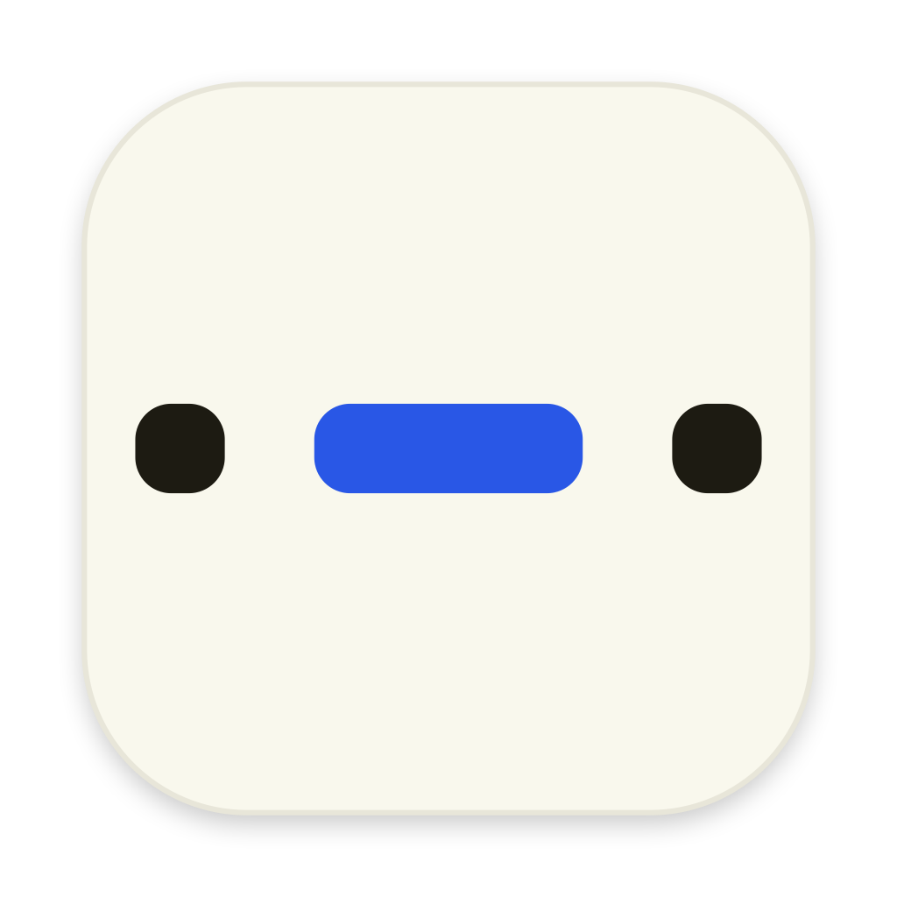

<div align="center">



# Thrum

**Words you can feel.**

Type anything. Your trackpad taps it back in Morse.

[**thrum-gilt.vercel.app**](https://thrum-gilt.vercel.app) · [**Download for macOS**](https://github.com/vraj00222/thrum/releases/latest)

Requires macOS 14. Apple silicon and Intel.

</div>

---

## What it is

Thrum turns typed text into Morse code and plays it through the MacBook trackpad's
Taptic Engine as physical taps. It's a menu bar app, a composer window, and a Morse
trainer that listens back.

## The constraint that shapes everything

The trackpad contains a **linear resonant actuator**, not a rumble motor. There is no
API that says "vibrate for 240 milliseconds" — you get discrete taps and nothing else.

So a `dah` isn't a longer buzz. It's a **tap train**: the inter-tap interval is held
constant and the pulse's duration decides how many taps fire. At 5 WPM a dit is 240ms
(8 taps) and a dah is 720ms (24 taps), so Morse's 1:3 ratio survives naturally.

Two things follow from that, and both are visible in the product:

- **Fast speeds are unusable haptically.** At 20 WPM a dit is two taps. The speed
  slider caps at 13 WPM, and Farnsworth timing lets you learn at character speed
  without sending faster than skin can read.
- **Not every Mac has a trackpad.** Thrum detects it and degrades to sound and light
  with a banner that says so, rather than failing silently.

Dit and dah also use **different actuation IDs**, so they differ in texture and not
only in length. Which pair feels most different is a property of a hand, so it's a
setting with a test control rather than a constant.

## Install

Thrum isn't notarised, so Gatekeeper will refuse it on first launch. Drag it to
Applications, then run this once:

```
xattr -dr com.apple.quarantine /Applications/Thrum.app
```

## Use

| | |
|---|---|
| Type and press Return | Plays through the trackpad |
| `⌃⌥⌘M` anywhere | Plays whatever's on the clipboard, window closed |
| Learn tab | Key with the spacebar; Thrum decodes your rhythm back into text |
| Click the tape | Jumps to that point |

## Build

```
make test       # the whole Swift suite, including a real 60-second drift test
make build      # assembles dist/Thrum.app (universal)
make release    # build, package a .dmg, publish it
make dev        # the landing page
make sweep      # fire every actuation ID so you can pick a dit/dah pair by feel
```

`swift test` needs Xcode's toolchain for XCTest; the Makefile sets `DEVELOPER_DIR`
so you don't have to `xcode-select` globally.

## Layout

```
mac/Sources/ThrumCore       Morse tables, PARIS + Farnsworth timing, pulse shaping,
                            receive decoding. Pure logic, no UI, fully tested.
mac/Sources/ThrumHaptics    MTActuator (private) and NSHapticFeedbackManager (public)
                            behind one protocol, with automatic fallback.
mac/Sources/ThrumPlayback   Drift-free absolute-deadline scheduling, 600Hz sidetone.
mac/Sources/ThrumApp        SwiftUI menu bar app and composer window.
web/                        Next.js landing page with a live in-browser demo.
fixtures/morse-cases.json   Read by both test suites, so the app and the web demo
                            cannot disagree about what SOS looks like.
```

`web/lib/morse.ts` is a port of `MorseCode.swift` and `web/lib/timing.ts` of
`MorseTiming.swift`. Keep them in sync — the shared fixtures will catch you if you
don't.

## Notes

The web demo is **sound and light only**. `navigator.vibrate` is unimplemented in
Safari and a no-op on desktop Chrome, Gamepad Haptics only reaches gamepads, and
WebHID can't see the internal trackpad. There's no permission prompt that unlocks
this — the plumbing doesn't exist. The app is the one you feel.

Thrum uses a private framework (`MultitouchSupport`), so it can't ship on the Mac
App Store and could break on any macOS point release. Symbols are resolved with
`dlsym` at runtime, so a rename degrades to the public haptic engine instead of
failing to launch.

Design decisions and their reasoning live in [DECISIONS.md](DECISIONS.md).
